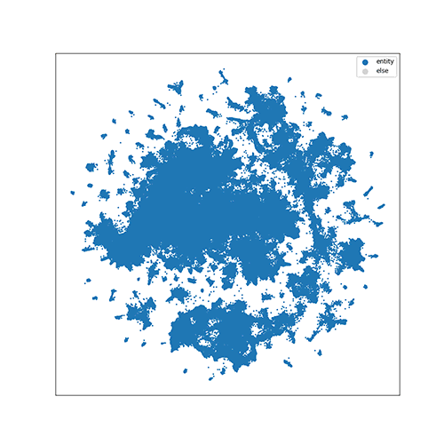

Benchmarks
==========

.. include:: link.rst

This page contains benchmarks of all models implemented in GraphVite, including their
time and performance. All experiments are conducted on a server with 24 CPU threads
and 4 V100 GPUs.

Node Embedding
--------------

We experiment node embedding models on 3 datasets, ranging from million-scale to
half billion-scale. The following table shows the size of each dataset, as well as
the time and resource required by `LINE`_ model.

+---------------------+-------+-------+---------------+-----------------+
| Dataset             | \|V\| | \|E\| | Training Time | GPU memory cost |
+=====================+=======+=======+===============+=================+
| `Youtube`_          | 1.1M  | 4.9M  | 1.17 mins     | 4 * 801 MiB     |
+---------------------+-------+-------+---------------+-----------------+
| `Flickr`_           | 1.7M  | 23M   | 3.54 mins     | 4 * 943 MiB     |
+---------------------+-------+-------+---------------+-----------------+
| `Friendster-small`_ | 7.9M  | 447M  | 1.84 hrs      | 4 * 2.42 GiB    |
+---------------------+-------+-------+---------------+-----------------+

The learned node embeddings are evaluated on the standard task of multi-label node
classifcation. We report micro-F1 and macro-F1 of each model, with regard to
different percentages of training data.

+------------+---------------+-------+-------+-------+-------+-------+-------+-------+-------+-------+-------+
| `Youtube`_ | %Labeled Data | 1%    | 2%    | 3%    | 4%    | 5%    | 6%    | 7%    | 8%    | 9%    | 10%   |
+============+===============+=======+=======+=======+=======+=======+=======+=======+=======+=======+=======+
|            | `DeepWalk`_   | 37.41 | 40.48 | 42.12 | 43.63 | 44.47 | 44.83 | 45.41 | 45.77 | 46.11 | 46.39 |
+            +---------------+-------+-------+-------+-------+-------+-------+-------+-------+-------+-------+
| Micro-F1   | `LINE`_       | 38.36 | 40.61 | 42.17 | 43.70 | 44.44 | 44.97 | 45.47 | 45.73 | 46.12 | 46.25 |
+            +---------------+-------+-------+-------+-------+-------+-------+-------+-------+-------+-------+
|            | `node2vec`_   | 37.91 | 40.59 | 42.37 | 43.56 | 44.32 | 44.94 | 45.40 | 45.77 | 46.07 | 46.41 |
+------------+---------------+-------+-------+-------+-------+-------+-------+-------+-------+-------+-------+
|            | `DeepWalk`_   | 30.77 | 33.67 | 34.91 | 36.44 | 37.02 | 37.27 | 37.74 | 38.17 | 38.35 | 38.51 |
+            +---------------+-------+-------+-------+-------+-------+-------+-------+-------+-------+-------+
| Macro-F1   | `LINE`_       | 30.90 | 33.69 | 34.88 | 36.40 | 36.75 | 37.44 | 37.89 | 38.07 | 38.30 | 38.40 |
+            +---------------+-------+-------+-------+-------+-------+-------+-------+-------+-------+-------+
|            | `node2vec`_   | 30.70 | 33.69 | 34.84 | 36.17 | 36.45 | 37.42 | 37.68 | 38.05 | 38.32 | 38.62 |
+------------+---------------+-------+-------+-------+-------+-------+-------+-------+-------+-------+-------+

.. seealso::
    Configuration files:
    :download:`deepwalk_youtube.yaml<../../config/graph/deepwalk_youtube.yaml>`
    :download:`line_youtube.yaml<../../config/graph/line_youtube.yaml>`
    :download:`node2vec_youtube.yaml<../../config/graph/node2vec_youtube.yaml>`

For larger datasets, `node2vec`_ fails with out-of-memory error, as it requires more
than 200 GiB memory to build alias tables for the 2nd order random walks.

+-----------+---------------+-------+-------+-------+-------+-------+-------+-------+-------+-------+
| `Flickr`_ | %Labeled Data | 10%   | 20%   | 30%   | 40%   | 50%   | 60%   | 70%   | 80%   | 90%   |
+===========+===============+=======+=======+=======+=======+=======+=======+=======+=======+=======+
|           | `DeepWalk`_   | 62.98 | 63.44 | 63.72 | 63.71 | 63.79 | 63.69 | 63.80 | 63.93 | 63.92 |
|           +---------------+-------+-------+-------+-------+-------+-------+-------+-------+-------+
| Micro-F1  | `LINE`_       | 63.05 | 63.45 | 63.69 | 63.73 | 63.79 | 63.82 | 64.00 | 63.69 | 63.79 |
|           +---------------+-------+-------+-------+-------+-------+-------+-------+-------+-------+
|           | `node2vec`_   | Out of Memory                                                         |
+-----------+---------------+-------+-------+-------+-------+-------+-------+-------+-------+-------+
|           | `DeepWalk`_   | 61.72 | 62.12 | 62.36 | 62.38 | 62.42 | 62.36 | 62.44 | 62.58 | 62.55 |
|           +---------------+-------+-------+-------+-------+-------+-------+-------+-------+-------+
| Macro-F1  | `LINE`_       | 61.77 | 62.14 | 62.35 | 62.39 | 62.46 | 62.45 | 62.64 | 62.28 | 62.45 |
|           +---------------+-------+-------+-------+-------+-------+-------+-------+-------+-------+
|           | `node2vec`_   | Out of Memory                                                         |
+-----------+---------------+-------+-------+-------+-------+-------+-------+-------+-------+-------+

.. seealso::
    Configuration files:
    :download:`deepwalk_flickr.yaml<../../config/graph/deepwalk_flickr.yaml>`
    :download:`line_flickr.yaml<../../config/graph/line_flickr.yaml>`

+---------------------+---------------+-------+-------+-------+-------+-------+-------+-------+-------+-------+-------+
| `Friendster-small`_ | %Labeled Data | 1%    | 2%    | 3%    | 4%    | 5%    | 6%    | 7%    | 8%    | 9 %   | 10%   |
+=====================+===============+=======+=======+=======+=======+=======+=======+=======+=======+=======+=======+
|                     | `DeepWalk`_   | 76.93 | 83.96 | 86.41 | 86.91 | 87.94 | 88.49 | 88.84 | 88.96 | 88.90 | 89.18 |
|                     +---------------+-------+-------+-------+-------+-------+-------+-------+-------+-------+-------+
| Micro-F1            | `LINE`_       | 76.53 | 83.50 | 85.70 | 87.29 | 87.97 | 88.17 | 88.69 | 88.87 | 88.76 | 89.20 |
|                     +---------------+-------+-------+-------+-------+-------+-------+-------+-------+-------+-------+
|                     | `node2vec`_   | Out of Memory                                                                 |
+---------------------+---------------+-------+-------+-------+-------+-------+-------+-------+-------+-------+-------+
|                     | `DeepWalk`_   | 71.54 | 81.34 | 84.57 | 85.75 | 86.77 | 87.48 | 87.93 | 88.02 | 88.25 | 88.42 |
|                     +---------------+-------+-------+-------+-------+-------+-------+-------+-------+-------+-------+
| Macro-F1            | `LINE`_       | 70.46 | 80.88 | 84.07 | 85.99 | 86.76 | 87.39 | 87.86 | 87.91 | 87.72 | 88.56 |
|                     +---------------+-------+-------+-------+-------+-------+-------+-------+-------+-------+-------+
|                     | `node2vec`_   | Out of Memory                                                                 |
+---------------------+---------------+-------+-------+-------+-------+-------+-------+-------+-------+-------+-------+

.. seealso::
    Configuration files:
    :download:`deepwalk_friendster-small.yaml<../../config/graph/deepwalk_friendster-small.yaml>`
    :download:`line_friendster-small.yaml<../../config/graph/line_friendster-small.yaml>`

Knowledge Graph Embedding
-------------------------

For knowledge graph embedding, we benchmark `TransE`_, `DistMult`_, `ComplEx`_ and
`RotatE`_ on 5 standard datasets. The training time, evaluation time and resource of
`RotatE`_ on these datasets are given in the following table.

+---------------------+-------+-------+-------+----------------------------+-----------------+
| Dataset             | \|V\| | \|E\| | \|R\| | Training / Evaluation Time | GPU memory cost |
+=====================+=======+=======+=======+============================+=================+
| `FB15k`_            | 15K   | 483K  | 1.3K  | 28.1 mins / 55.8 s         | 4 * 788 MiB     |
+---------------------+-------+-------+-------+----------------------------+-----------------+
| `FB15k-237`_        | 15K   | 272K  | 237   | 15.3 mins / 20.8 s         | 4 * 758 MiB     |
+---------------------+-------+-------+-------+----------------------------+-----------------+
| `WN18`_             | 41K   | 141K  | 18    | 16.4 mins / 12.0 s         | 4 * 776 MiB     |
+---------------------+-------+-------+-------+----------------------------+-----------------+
| `WN18RR`_           | 41K   | 87K   | 11    | 14.8 mins / 8.98 s         | 4 * 776 MiB     |
+---------------------+-------+-------+-------+----------------------------+-----------------+
| `Wikidata5m`_       | 5.0M  | 21M   | 828   | 2.10 hrs / 54.9 mins       | 4 * 2.96 GiB    |
+---------------------+-------+-------+-------+----------------------------+-----------------+

To evaluate the knowledge graph embeddings, we test them on the link prediction
task. We report the results for each model on the test set, where ranking metrics
are computed based on filtered results.

+-------------+-----+-------+---------+---------+----------+
| `FB15k`_    | MR  | MRR   | HITS\@1 | HITS\@3 | HITS\@10 |
+=============+=====+=======+=========+=========+==========+
| `TransE`_   | 57  | 0.614 | 0.459   | 0.739   | 0.849    |
+-------------+-----+-------+---------+---------+----------+
| `DistMult`_ | 70  | 0.765 | 0.698   | 0.812   | 0.874    |
+-------------+-----+-------+---------+---------+----------+
| `ComplEx`_  | 236 | 0.679 | 0.596   | 0.735   | 0.821    |
+-------------+-----+-------+---------+---------+----------+
| `SimplE`_   | 87  | 0.791 | 0.737   | 0.828   | 0.882    |
+-------------+-----+-------+---------+---------+----------+
| `RotatE`_   | 36  | 0.767 | 0.687   | 0.830   | 0.891    |
+-------------+-----+-------+---------+---------+----------+

.. seealso::
    Configuration files:
    :download:`transe_fb15k.yaml<../../config/knowledge_graph/transe_fb15k.yaml>`
    :download:`distmult_fb15k.yaml<../../config/knowledge_graph/distmult_fb15k.yaml>`
    :download:`complex_fb15k.yaml<../../config/knowledge_graph/complex_fb15k.yaml>`
    :download:`simple_fb15k.yaml<../../config/knowledge_graph/simple_fb15k.yaml>`
    :download:`rotate_fb15k.yaml<../../config/knowledge_graph/rotate_fb15k.yaml>`

+--------------+-----+-------+---------+---------+----------+
| `FB15k-237`_ | MR  | MRR   | HITS\@1 | HITS\@3 | HITS\@10 |
+==============+=====+=======+=========+=========+==========+
| `TransE`_    | 172 | 0.288 | 0.190   | 0.324   | 0.487    |
+--------------+-----+-------+---------+---------+----------+
| `DistMult`_  | 224 | 0.295 | 0.204   | 0.329   | 0.478    |
+--------------+-----+-------+---------+---------+----------+
| `ComplEx`_   | 372 | 0.271 | 0.184   | 0.301   | 0.447    |
+--------------+-----+-------+---------+---------+----------+
| `SimplE`_    | 253 | 0.284 | 0.196   | 0.315   | 0.462    |
+--------------+-----+-------+---------+---------+----------+
| `RotatE`_    | 201 | 0.314 | 0.218   | 0.348   | 0.506    |
+--------------+-----+-------+---------+---------+----------+

.. seealso::
    Configuration files:
    :download:`transe_fb15k-237.yaml<../../config/knowledge_graph/transe_fb15k-237.yaml>`
    :download:`distmult_fb15k-237.yaml<../../config/knowledge_graph/distmult_fb15k-237.yaml>`
    :download:`complex_fb15k-237.yaml<../../config/knowledge_graph/complex_fb15k-237.yaml>`
    :download:`simple_fb15k-237.yaml<../../config/knowledge_graph/simple_fb15k-237.yaml>`
    :download:`rotate_fb15k-237.yaml<../../config/knowledge_graph/rotate_fb15k-237.yaml>`

+-------------+------+-------+---------+---------+----------+
| `WN18`_     | MR   | MRR   | HITS\@1 | HITS\@3 | HITS\@10 |
+=============+======+=======+=========+=========+==========+
| `TransE`_   | 522  | 0.545 | 0.211   | 0.881   | 0.933    |
+-------------+------+-------+---------+---------+----------+
| `DistMult`_ | 661  | 0.819 | 0.717   | 0.918   | 0.945    |
+-------------+------+-------+---------+---------+----------+
| `ComplEx`_  | 1262 | 0.877 | 0.857   | 0.892   | 0.909    |
+-------------+------+-------+---------+---------+----------+
| `SimplE`_   | 487  | 0.944 | 0.941   | 0.946   | 0.949    |
+-------------+------+-------+---------+---------+----------+
| `RotatE`_   | 303  | 0.948 | 0.924   | 0.950   | 0.957    |
+-------------+------+-------+---------+---------+----------+

.. seealso::
    Configuration files:
    :download:`transe_wn18.yaml<../../config/knowledge_graph/transe_wn18.yaml>`
    :download:`distmult_wn18.yaml<../../config/knowledge_graph/distmult_wn18.yaml>`
    :download:`complex_wn18.yaml<../../config/knowledge_graph/complex_wn18.yaml>`
    :download:`simple_wn18.yaml<../../config/knowledge_graph/simple_wn18.yaml>`
    :download:`rotate_wn18.yaml<../../config/knowledge_graph/rotate_wn18.yaml>`

+-------------+-------+-------+---------+---------+----------+
| `WN18RR`_   | MR    | MRR   | HITS\@1 | HITS\@3 | HITS\@10 |
+=============+=======+=======+=========+=========+==========+
| `TransE`_   | 3834  | 0.219 | 0.015   | 0.398   | 0.523    |
+-------------+-------+-------+---------+---------+----------+
| `DistMult`_ | 5065  | 0.449 | 0.419   | 0.466   | 0.504    |
+-------------+-------+-------+---------+---------+----------+
| `ComplEx`_  | 12602 | 0.328 | 0.312   | 0.339   | 0.353    |
+-------------+-------+-------+---------+---------+----------+
| `SimplE`_   | 5569  | 0.446 | 0.421   | 0.458   | 0.492    |
+-------------+-------+-------+---------+---------+----------+
| `RotatE`_   | 2359  | 0.500 | 0.455   | 0.518   | 0.589    |
+-------------+-------+-------+---------+---------+----------+

.. seealso::
    Configuration files:
    :download:`transe_wn18rr.yaml<../../config/knowledge_graph/transe_wn18rr.yaml>`
    :download:`distmult_wn18rr.yaml<../../config/knowledge_graph/distmult_wn18rr.yaml>`
    :download:`complex_wn18rr.yaml<../../config/knowledge_graph/complex_wn18rr.yaml>`
    :download:`simple_wn18rr.yaml<../../config/knowledge_graph/simple_wn18rr.yaml>`
    :download:`rotate_wn18rr.yaml<../../config/knowledge_graph/rotate_wn18rr.yaml>`

+---------------+--------+-------+---------+---------+----------+
| `Wikidata5m`_ | MR     | MRR   | HITS\@1 | HITS\@3 | HITS\@10 |
+===============+========+=======+=========+=========+==========+
| `TransE`_     | 109370 | 0.253 | 0.170   | 0.311   | 0.392    |
+---------------+--------+-------+---------+---------+----------+
| `DistMult`_   | 211030 | 0.253 | 0.209   | 0.278   | 0.334    |
+---------------+--------+-------+---------+---------+----------+
| `ComplEx`_    | 244540 | 0.281 | 0.228   | 0.310   | 0.373    |
+---------------+--------+-------+---------+---------+----------+
| `SimplE`_     | 112754 | 0.296 | 0.252   | 0.317   | 0.377    |
+---------------+--------+-------+---------+---------+----------+
| `RotatE`_     | 89459  | 0.290 | 0.234   | 0.322   | 0.390    |
+---------------+--------+-------+---------+---------+----------+

.. seealso::
    Configuration files:
    :download:`transe_wikidata5m.yaml<../../config/knowledge_graph/transe_wikidata5m.yaml>`
    :download:`distmult_wikidata5m.yaml<../../config/knowledge_graph/distmult_wikidata5m.yaml>`
    :download:`complex_wikidata5m.yaml<../../config/knowledge_graph/complex_wikidata5m.yaml>`
    :download:`simple_wikidata5m.yaml<../../config/knowledge_graph/simple_wikidata5m.yaml>`
    :download:`rotate_wikidata5m.yaml<../../config/knowledge_graph/rotate_wikidata5m.yaml>`

Graph & High-dimensional Data Visualization
-------------------------------------------

The high-dimensional data visualization is evaluated on two popular image datasets.
The training time and resource needed by `LargeVis`_ is given in the following table.
Note that more than 95% GPU memory cost comes from the construction of KNN Graph, and
can be traded off with speed if necessary.

+-------------+------------------+-------+------+---------------+-----------------+
| Dataset     | Vector           | N     | dim  | Training Time | GPU memory cost |
+=============+==================+=======+======+===============+=================+
| `MNIST`_    | Raw pixels       | 70K   | 784  | 13.9 s        | 2.86 GiB        |
+-------------+------------------+-------+------+---------------+-----------------+
| `ImageNet`_ | ResNet50 feature | 1.33M | 2048 | 13.6 mins     | 15.1 GiB        |
+-------------+------------------+-------+------+---------------+-----------------+

.. seealso::
    Configuration files:
    :download:`largevis_mnist_2d.yaml<../../config/visualization/largevis_mnist_2d.yaml>`
    :download:`largevis_imagenet.yaml<../../config/visualization/largevis_imagenet.yaml>`

Here is a 3D visualization result of `MNIST`_.

.. image:: ../../asset/visualization/mnist_3d.gif

For `ImageNet`_, since it contains 1000 classes, we visualize classes according to
their hierarchy in `WordNet`_. The following animation shows how the class of
``english setter`` (a kind of dog) is traversed in the hierarchy.

