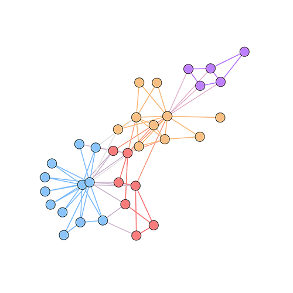

GraphVite - graph embedding at high speed and large scale
=========================================================

.. include:: link.rst

GraphVite is a general graph embedding engine, dedicated to high-speed and
large-scale embedding learning in various applications. By cooperating CPUs and GPUs
for learning, it scales to million-scale or even billion-scale graphs. With its
Python interface, you can easily practice advanced graph embedding algorithms, and
get results in incredibly short time.

Try GraphVite if you have any of the following demands.

- You want to reproduce graph learning algorithms on a uniform platform.
- You need fast visualization for graphs or high-dimensional data.
- You are tired of waiting a long time for prototyping or tuning models.
- You need to learn representations of large graphs or knowledge graphs.

Generally, GraphVite provides complete training and evaluation pipelines for 3
applications: **node embedding**, **knowledge graph embedding** and
**graph & high-dimensional data visualization**. Besides, it also includes 9 popular
models, along with their benchmarks on a bunch of standard datasets.

    Node Embedding

    Knowledge Graph |br| Embedding

.. figure:: ../../asset/visualization.png
    :align: left
    :height: 180px
    :target: overview.html#graph-high-dimensional-data-visualization
    :figclass: align-center

    Graph & |br| High-dimensional |br| Data Visualization

.. |br| raw:: html

     

.. raw:: html

    

How fast is GraphVite?
----------------------

To give a brief idea of GraphVite's speed, we summarize the training time of
GraphVite along with the best open-source implementations. All the time is reported
based on a server with 24 CPU threads and 4 V100 GPUs.

Node embedding on `Youtube`_ dataset.

+-------------+----------------------------+-----------+---------+
| Model       | Existing Implementation    | GraphVite | Speedup |
+=============+============================+===========+=========+
| `DeepWalk`_ | `1.64 hrs (CPU parallel)`_ | 1.19 mins | 82.9x   |
+-------------+----------------------------+-----------+---------+
| `LINE`_     | `1.39 hrs (CPU parallel)`_ | 1.17 mins | 71.4x   |
+-------------+----------------------------+-----------+---------+
| `node2vec`_ | `24.4 hrs (CPU parallel)`_ | 4.39 mins | 334x    |
+-------------+----------------------------+-----------+---------+

.. _1.64 hrs (CPU parallel): https://github.com/phanein/deepwalk
.. _1.39 hrs (CPU parallel): https://github.com/tangjianpku/LINE
.. _24.4 hrs (CPU parallel): https://github.com/aditya-grover/node2vec

Knowledge graph embedding on `FB15k`_ dataset.

+-----------+-------------------------+-----------+---------+
| Model     | Existing Implementation | GraphVite | Speedup |
+===========+=========================+===========+=========+
| `TransE`_ | `1.31 hrs (1 GPU)`_     | 14.8 mins | 5.30x   |
+-----------+-------------------------+-----------+---------+
| `RotatE`_ | `3.69 hrs (1 GPU)`_     | 27.0 mins | 8.22x   |
+-----------+-------------------------+-----------+---------+

.. _1.31 hrs (1 GPU): https://github.com/DeepGraphLearning/KnowledgeGraphEmbedding
.. _3.69 hrs (1 GPU): https://github.com/DeepGraphLearning/KnowledgeGraphEmbedding

High-dimensional data visualization on `MNIST`_ dataset.

+-------------+-----------------------------+-----------+---------+
| Model       | Existing Implementation     | GraphVite | Speedup |
+=============+=============================+===========+=========+
| `LargeVis`_ | `15.3 mins (CPU parallel)`_ | 15.1 s    | 60.8x   |
+-------------+-----------------------------+-----------+---------+

.. _15.3 mins (CPU parallel): https://github.com/lferry007/LargeVis

Comparison to concurrent work
-----------------------------

A work concurrent to GraphVite is `PyTorch-BigGraph`_, which aims at accelerating
knowledge graph embedding on large-scale data. Here is an apple-to-apple comparison
of models implemented in both libraries on `FB15k`_, under the same hyperparameter
setting.

.. _PyTorch-BigGraph: https://torchbiggraph.readthedocs.io

+-------------+------------------+-----------+---------+
| Model       | PyTorch-BigGraph | GraphVite | Speedup |
+=============+==================+===========+=========+
| `TransE`_   | 1.21 hrs         | 11.1 mins | 6.57x   |
+-------------+------------------+-----------+---------+
| `DistMult`_ | 2.48 hrs         | 25.0 mins | 5.93x   |
+-------------+------------------+-----------+---------+
| `ComplEx`_  | 3.13 hrs         | 20.6 mins | 9.13x   |
+-------------+------------------+-----------+---------+

GraphVite surpasses its counterpart by a signficant margin. Besides, the framework of
GraphVite also supports two more applications, and provides many benchmarks for easy
research and development.

About the name
--------------
GraphVite(/ɡɹæfvit/) is a combination of English word "graph" and French word
"vite", which means "rapid". GraphVite represents the traits of this library,
as well as the bilingual environment of `Mila`_ where the library was developed.

.. _Mila: https://mila.quebec